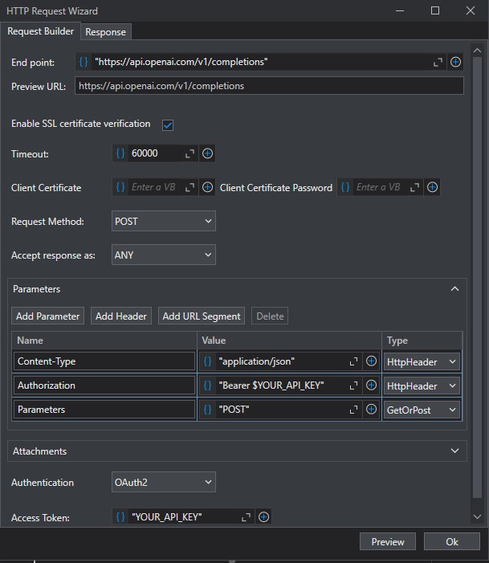

# Simple application utilizing ChatGPT and UIPath for analysis and categorization of reasons for Facebook account deletions.

The application utilizes ChatGPT with an appropriate prompt to analyze reasons for Facebook account deletions provided in an Excel spreadsheet, then assigns them to respective categories. UIPath software was employed for automating this process.

# How to use it?

To use the application, you must first find your OpenAI API key on your account, and then paste it into the places marked YOUR_API_KEY on the screenshot below..

